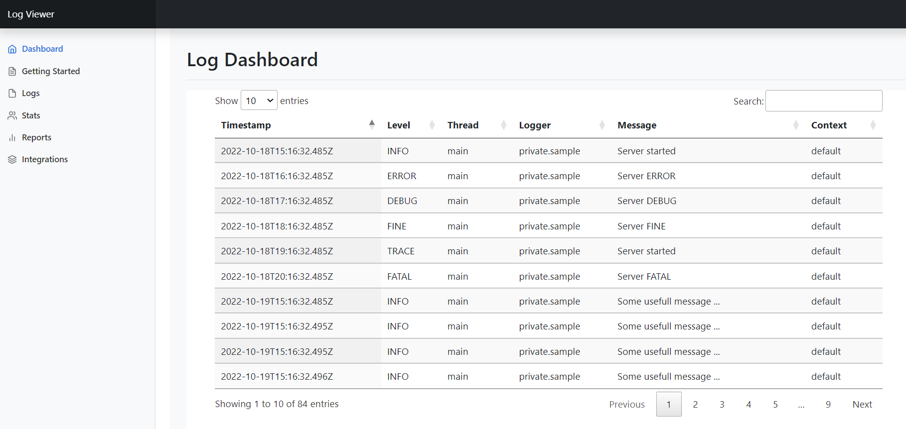

# Logviewer

Store and view logs online. This is a node.js based application ment for developers to easily set up an "online or local" log sink and watch, analyse, sort, filter and export logs.

Easy to set up. Easy to integrate. Easy to customize.

When the app recieves a log message it uses Winston.js to store the message. This is done so the usual things like log rotation, log size limitation and so on work.

The used bootstrap/datatable implementation is very flexible and can be used for any kind of json data. Based on the first json entry in the log file it will create a table with columns based on the json attributes. The resulting datatable can then for example be integrated as an iframe.  

To finish it up there is nice bootstrap based landing page with usefull tipps and tricks combining all together as a sample.




# Prerequisites

- Node.js
- NPM

# Quick start guide 

Click here to see it in action on Codesandbox.

- Run `npm install` to installl dependencies
- Run `npm start` to start the local server
- Load `http://localhost:3000` to test the endpoint. It will display a json result `{"message":"See https://github.com/Ckal/logviewer for more detials ... "}`

Open this link to see the  landing page with sample data.

Open this link to delte the current log.

Open this link to store a new log entry.

Have a look at the content of the iframe.


# API Endpoints

## GET /
Some examples, usefull links, tipps and howto's.

```bash
curl --header "Content-Type: application/json" \
 --request GET \
 http://localhost:3000/
```

## GET /api/delteLog

Deltes the current log. For a fresh start

```bash
curl http://localhost:3000/api/delteLog
```

## GET /api/saveLog?message={"log.level":"info","timestamp":"today","message":"This is a usefull sample"} 

```bash
curl http://localhost:3000/api/saveLog?message={"log.level":"info","timestamp":"today","message":"This is a usefull sample"}
```

## GET /logViewer
See the logs in a nice table. The table columns are based on json attribute. -> You chose the columns by uploading json
```bash
curl http://localhost:3000/viewLog
```

## GET /viewRawLog
See the logs in a nice table. The table columns are based on json attribute. -> You chose the columns by uploading json
```bash
curl http://localhost:3000/viewRawLog
```
