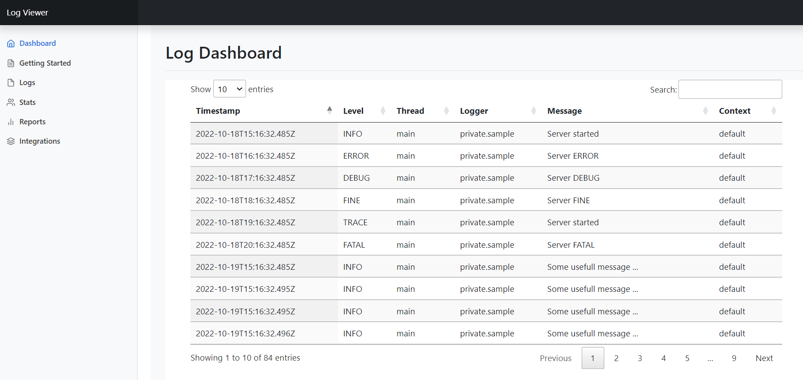

# Logviewer

Store and view logs online. This is a node.js based application ment for developers to easily set up an "online or local" log sink and watch, analyse, sort, filter and export logs.

Easy to set up. Easy to integrate. Easy to customize.

When the app receives a log message it uses Winston.js to store the message. This is done so the usual things like log rotation, log size limitation and so on work.

The used bootstrap/datatable implementation is very flexible and can be used for any kind of json data. Based on the first json entry in the log file it will create a table with columns based on the json attributes. The resulting datatable can then for example be integrated as an iframe.  

To finish it up there is nice bootstrap based landing page with useful tips and tricks combining all together as a sample.



# Prerequisites

- Node.js
- NPM

# Quick start guide

Click here to see it in action on Codesandbox. <https://codesandbox.io/s/github/Ckal/logviewer>

- Run `npm install` to installl dependencies
- Run `npm start` to start the local server
- Load `http://localhost:3000` to test the endpoint. It will display a json result `{"message":"See https://github.com/Ckal/logviewer for more details ... "}`

Open this link to see the landing page with sample data.
<http://localhost:3000/logviewer>

Open this link to delete the current log.
<http://localhost:3000/api/deleteLog>

Open this link to store a new log entry.
<http://localhost:3000/api/saveLog?message={%22timstamp%20%22%20:%20%22Oct-17-2022%2017:56:10%22,%20%22level%22%20:%20%22info%22,%20%22message%22:%20%22%20Server%20Started%20in%20port%20:%203000!%22>}

Have a look at the content of the iframe.
<http://localhost:3000/logViewerFrame>

The raw can be accessed by this link
<http://localhost:3000/api/getRawLog>

Replace the current logs with others sample data found under sample logs

# Remote sample on Codesandbox

<https://tzfrxg-3000.preview.csb.app/logviewer>

# Configuration

For Winston.js logger changes like retention see logger.js

# Dependencies

Dependencies can be found in package.json

# Swagger

[OpenAPI 3.0.0](https://github.com/Ckal/logviewer/blob/main/openAPI.yaml)

# Integration sample

Integrate the log table in a other page by adding this iframe. (adjust the link src)

```html
<div style="position:relative;padding-top:56.25%;">
<iframe src="./logViewerFrame" frameborder="0" allowfullscreen
    style="position:absolute;top:0;left:0;width:100%;height:90%;"></iframe>
</div>
```

Simple curl example to add a log entry

```bash
curl http://localhost:3000/api/saveLog?message={"log.level":"info","timestamp":"today","message":"This is a usefull sample"}
```

# API Endpoints
 

Here are some sample cURL commands for the API calls defined in the OpenAPI specification:


## GET /
Get the log viewer dashboard:

```bash
curl -X GET "http://localhost:3000?key=YOUR_API_KEY"
```

## GET /logViewer

See the logs in a nice table. The table columns are based on json attribute. -> You chose the columns by uploading json

```bash
curl http://localhost:3000/viewLog
```

## GET /info
Get API information:
```bash
curl -X GET "http://localhost:3000/info"
```

## GET /api/saveLog?message={"log.level":"info","timestamp":"today","message":"This is a useful sample"}

```bash
curl http://localhost:3000/api/saveLog?message={"log.level":"info","timestamp":"today","message":"This is a useful sample"}
```


## GET api/getRawDataLog
Get the raw log data:
```bash
curl -X GET "http://localhost:3000/api/getRawLog?key=YOUR_API_KEY&filename=onlineLog"
```

## GET api/getDataTableLog
Get the log data in a format optimized for a data table:
```bash
curl -X GET "http://localhost:3000/api/getDataTableLog?key=YOUR_API_KEY&filename=onlineLog"
```

## DELTE api/deleteLog
Delete a specific log file:
```bash
curl -X DELETE "http://localhost:3000/api/deleteLog?key=YOUR_API_KEY&filename=onlineLog"
```

## GET /api/delteLog

Deltes the current log. For a fresh start

```bash
curl http://localhost:3000/api/delteLog
```


## GET /logs
Retrieves a list of log files in the public/logs folder and returns them as HTML download links:
```bash
curl -X GET "http://localhost:3000/logs?key=YOUR_API_KEY"
```

Note that in the above examples, you should replace "YOUR_API_KEY" with the actual value of your API key. If not specified (via env. variables it open for all) Same for host. If not specified the filename default to onlineLog.log. There is get implementation for all call so they can be tested via the browser.


